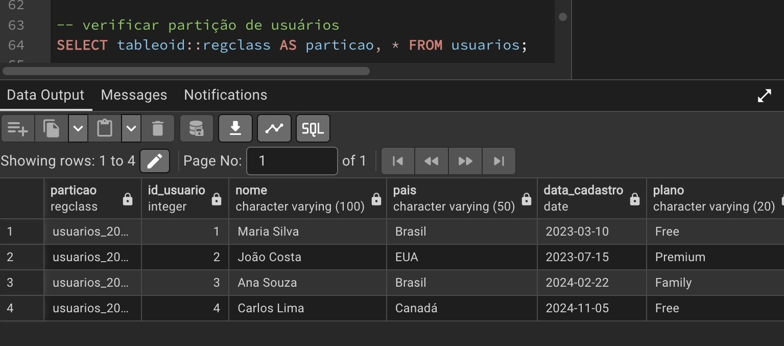
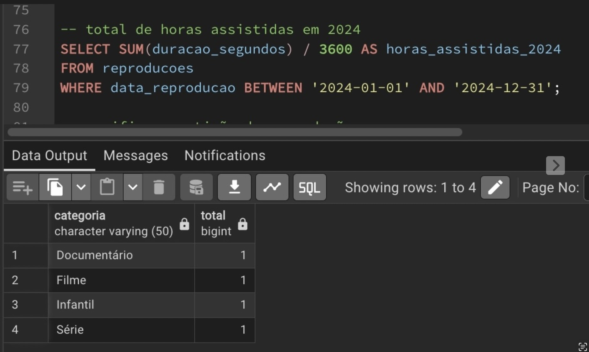

📊 StreamNow – Particionamento de Dados no PostgreSQL
Este projeto foi desenvolvido para demonstrar o uso de particionamento de dados no PostgreSQL com foco em desempenho e organização para grandes volumes de dados, simulando uma plataforma de streaming chamada StreamNow.
A plataforma possui milhões de usuários e bilhões de registros de reproduções, então o particionamento ajuda a melhorar consultas, manutenção e escalabilidade.
🎯 Objetivo
Criar tabelas particionadas no PostgreSQL
Definir partições adequadas para cada tabela
Inserir dados e realizar consultas
Mostrar evidências com prints
Organizar tudo no repositório no padrão solicitado
🧠 Estratégia de Particionamento
📁 Tabela usuarios
Particionamento escolhido: LIST (por país)
Motivo: A maioria das consultas de marketing envolve comparar países e analisar crescimento por região. Como existem muitos países, mas fizemos exemplo simples, LIST é adequado para separar por país.
Benefício: Facilita consultas e comparações entre países e também organização dos dados.
🎥 Tabela reproducoes
Particionamento escolhido: RANGE (por data de reprodução)
Motivo: A tabela cresce diariamente com milhões de novos registros. Consultas comuns são por mês e período.
Benefício: Melhora performance em consultas por período e facilita arquivamento de dados antigos.
📁 Estrutura do Repositório
streamnow-particionamento/
│
├── scripts/
│ ├── 01_create_tables.sql
│ ├── 02_create_partitions.sql
│ ├── 03_inserts.sql
│ ├── 04_queries.sql
│
├── prints/
│
└── README.md
 
## Prints das Consultas

### 1️⃣ Partição dos usuários  

### 2️⃣ Usuários cadastrados em 2023  

### 3️⃣ Partição das reproduções  

### 4️⃣ Total de reproduções por categoria  

### 5️⃣ Total de horas assistidas  

✅ Conclusão
O particionamento ajudou a:
Melhorar consultas frequentes
Organizar grandes volumes de dados
Facilitar manutenção do banco
Simular cenário real de streaming
Esse projeto segue as boas práticas aprendidas em sala e cumpre os requisitos da atividade prática.
